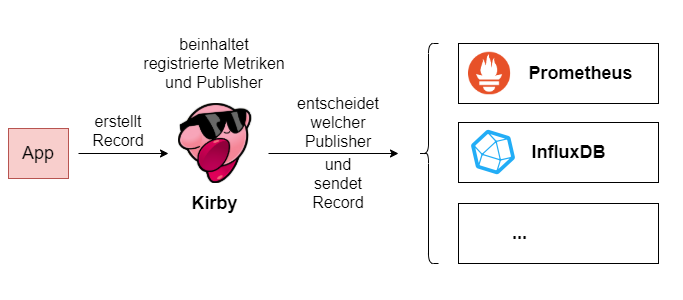
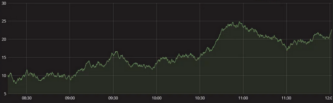
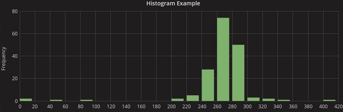
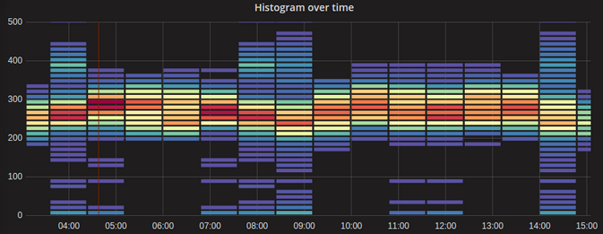

# kirby

> Service to publish metrics to Prometheus and Co.

---

Kirby dient also als Abstraktionsebene zwischen uns als Anwender der Library und den unterschiedlichen Clients für spezielle Metriken TSDBs (z.B. Prometheus, Influx, ...). Dabei kann dann mit einer einheitlichen Schnittstelle gesprochen werden, ohne die dahinterliegende Implementation zu kennen, dadurch kann 1. der Provider (Prometheus -> Influx) einfacher gewechselt werden und 2. müssen sich die Entwickler nicht in unterschiedliche Systeme einarbeiten.

Dabei wurde der Projektname *Kirby* gewählt, weil er wie ein Metrikensystem alles aufsaugt und entsprechend verarbeitet. Außerdem ist Kirby cool, hallo?



# Konzept: Metrik

Bevor man anfängt die Bibliothek zu benutzen, sollte man verstehen, was Metriken eigentlich genau sind und in welchen Gestalten sie vorkommen - besonders im Kontext von Kirby.  
Eine *Metrik* ist ganz abstrakt erstmal eine Form einer Messung. Das bedeutet sie beinhaltet Vorschriften, wie eine Messung auszusehen hat und wie diese Messdaten dann in ein Metriken-geeignetes Format gebracht werden.

Die einfachste Vorstellung einer solchen Messung ist die einer *Gauge*, also die eines Messgerätes, bei der die Werte zunehmen und abnehmen können. Hier ein Beispiel mit Temperaturen in Celsius pro Minute:



Doch für bestimmte Zwecke, und besonders im Prometheus-Umfeld, gibt es noch komplexere Metrikentypen, die sich für unterschiedliche Anwendungszwecke eignen.  
Die wohl bekannteste Gestalt ist die eines *Histogramms*, also einer direkten Unterteilung in unterschiedliche Messbereiche (auch *Buckets* genannt) der Messdaten.



Bei dem Histogramm wurden Frequenzen zwischen 0 und 420 berechnet. Man erkennt, dass dadurch eine Häufigkeitsverteilung entsteht. Dadurch können direkt Aussagen getroffen werden, wie häufig bestimmte Messdaten auftreten.  
Wenn man sich nicht zufrieden gibt und man unbedingt eine zeitliche Komponente in ein Histogram hineinkriegen will, geht das z.B. über Heatmaps. Hier eine Heatmap des oben gezeigten Histogramms für unterschiedliche Zeitpunkte:



Eine Übersicht der verschiedenen Metrikentypen hier als Tabelle:

| Typ       | Beschreibung                                             |
| --------- | -------------------------------------------------------- |
| Gauge     | Kann erhöht und verniedrigt werden.                      |
| Counter   | Kann nur erhöht werden (oder resetted auf 0).            |
| Histogram | Stellt zusätzlich zur Observation einen `_bucket`, `_count` und `_sum` bereit. *count* ist die insgesamte Anzahl an Observations und *sum* ist die Summe aller Observations. Die *bucket*s sind dabei aus der Histogram-Statistik die *Klassen*, also ein Bucket ist dafür da, alle Einträge zu tracken, die eine bestimmte "Füllhöhe" haben. (z.B. alle Einträge von Requestzeiten, die unter 0.1s liegen)  |
| Summary   | Macht das Gleiche wie ein Histogram, nur dass anstatt Buckets direkt *Quantile* exposed werden. Diese werden z.B. als Tag an die Metrik drangehangen. Ein Quantil $`\varphi \in [0, 1]`$ gibt eine Aussage darüber, welche Werte in Prozent vorkommen. (Beispiel: "25% aller Spieler haben weniger als 100h Spielzeit" wäre das 0.25 Quantil mit Wert 100h)      |

Ein Quantil ist die Fläche unter dem Graphen der Normalverteilung, bis zu einem bestimmten % des Maximalwertes, als Beispiel wäre das Quantil 0.5 der Median.

# Setup

Um die Library zu benutzen, muss zuerst das Modul `kirby-provider-spigot` gebaut und auf dem jeweiligen Server hochgeladen werden.  
Zudem muss dann entsprechend eine `config.yml` in den Ordner `plugins/KirbySpigot` gelegt werden. Eine Beispielkonfiguration für Prometheus wäre:

```yaml
host: your.hostname.here
port: 80
user: admin
password: password
type: pushgateway
job_name: lobby
```

Danach sollte das Plugin ganz normal laden.

# Benutzung

Folgende Maven Dependencies hinzufügen:

```xml
<dependency>
    <groupId>dev.volix.rewinside.odyssey.common</groupId>
    <artifactId>kirby-api</artifactId>
    <version>[0.0,)</version>
</dependency>

<!-- Damit wir den registrierten Service holen können -->
<dependency>
    <groupId>dev.volix.lib</groupId>
    <artifactId>grape-api</artifactId>
    <version>[0.0,)</version>
</dependency>
```

Und dann in der `plugin.yml`:

```yaml
...
depend: [KirbySpigot]
```

Damit das entsprechende Kirby Plugin auch vorher geladen wird.

## Den Service holen

Der Service wird über *Grape* bereitgestellt.

```java
Future<KirbyService> future = Grape.getInstance().get(KirbyService.class);
KirbyService service = future.get();
```

Natürlich kann mit der `Future` auch noch mehr Sachen gemacht werden. Wichtig ist normalerweise, dass der Service nicht unbedingt beim Pluginstart verfügbar ist - in dem Fall startet aber sowohl Grape als auch Kirby sowieso vorher.

## Eine Metrik erstellen

Nachdem der Service nun bereit steht, muss man aber noch vorher eine Metrik erstellen, nach der dann die Records gepublished werden können. Dafür muss erstmal die `Metric` Klasse extended werden. Hier ein Beispiel anhand einer Metrik, die die aktuelle Anzahl an Entities auf dem Server trackt:

```java
class EntitiesTotalMetric extends Metric {

    public EntitiesTotalMetric() {
        super(
            "entities_total", // der Name der Metrik als eindeutiger Schlüssel
            "How much entities there are lol", // Beschreibung
            MetricType.GAUGE, // Der Typ der Metrik siehe oben
            Arrays.asList("server") // Liste an Tagnamen
        );
    }

}
```

Danach muss dann diese Klasse beim Service registriert werden:

```java
service.registerMetric(new EntitiesTotalMetric());
```

## Einen Record publishen

Nun können wir einen Record für unsere neu erstellte Metrik publishen:

```java
service.record(EntitiesTotalMetric.class)
    .tag("server", "Lobby-1")
    .value(Bukkit.getServer().getWorlds().get(0).getEntities().size())
    .publish();
```

Beachte: Das Ganze wird asynchron gepublished, d.h. hier muss **nicht** zusätzlich ein Thread erstellt werden.

# Schlusswort

Ciao. 👋
